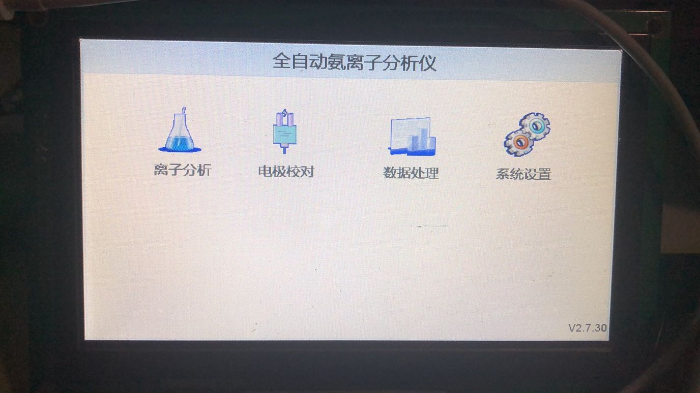
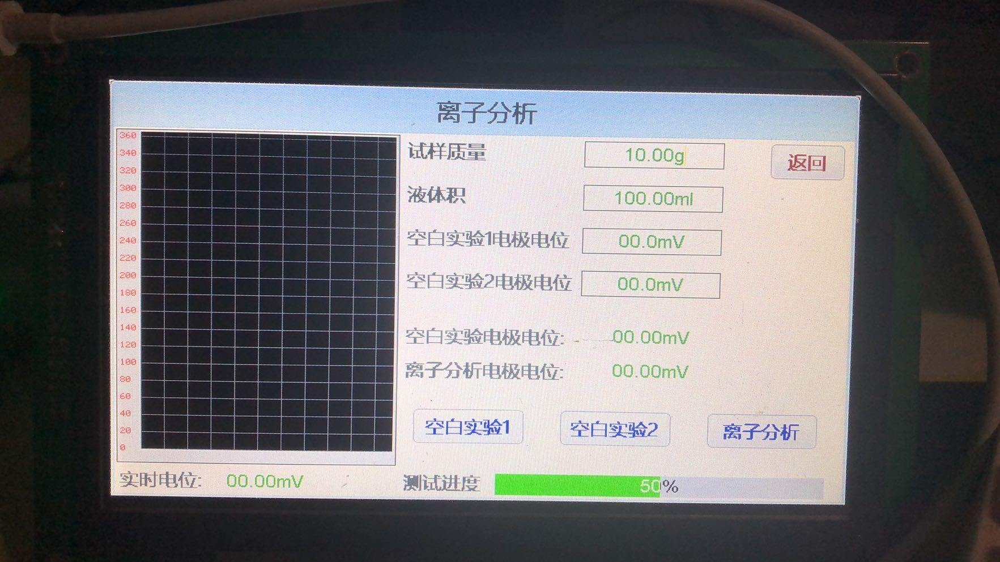
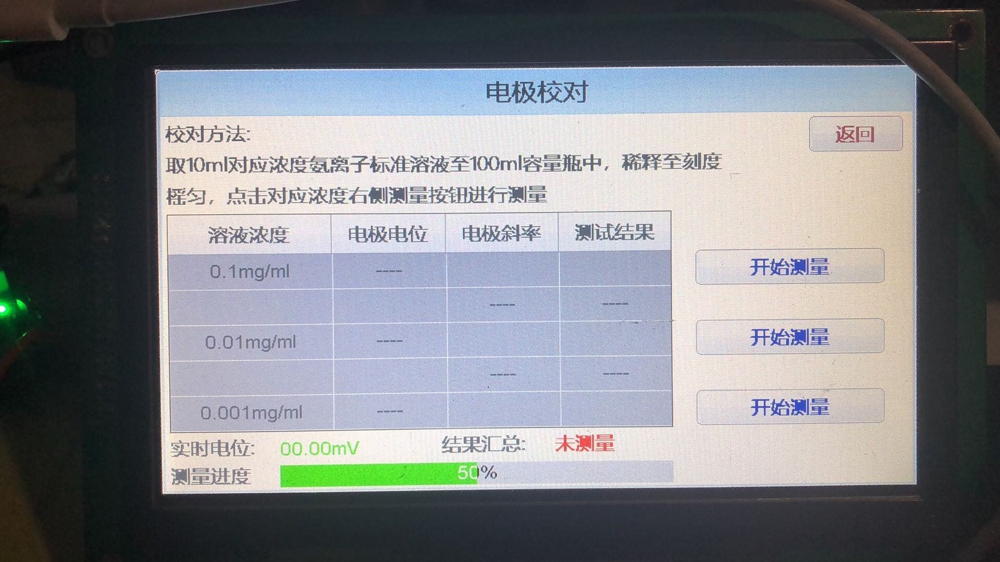

# 氨离子分析仪方案设计

[TOC]

## 方案设计

氨离子分析仪硬件根据氯离子测试仪进行裁剪优化，
软件根据国标设计，沿用氯离子测试仪设计思路

### 氯离子测试仪硬件列表

氨离子分析仪硬件根据氯离子测试仪进行裁剪优化，罗列氯离子
测试仪硬件资源如下

- 温度传感器ds18b20
- 高精度AD采集ADS770x
- 蜂鸣器
- 实时时钟RTC
- 串口打印机
- U盘支持
- 搅拌电机，带调速功能
- 上下限位开关IO输入检测
- 电磁阀控制(双路IO)
- 步进电机
- 7寸LCD显示屏
- 显示屏电阻触摸
- w25xxx 数据存储
- 调试相关接口(UART, JTAG)

### 氨离子分析仪需求列表

- 支持-2V~+2V电压采集，电压精度为1mV,电压输入端为电极
- 支持蜂鸣器人机交互，按键触发或其他必要情况下，有声音辅助提示
- 支持电极校对功能，给出校对结果，校对方法参照国标
- 支持离子分析功能，能够根据国标给出离子分析结果
- 支持至少100条离子分析结果的保存
- 支持保存的离子分析结果查看、删除功能，数据以时间为标签保存
- 支持保存的离子分析结果通过U盘导出
- 支持离子分析结果通过串口打印机打印
- 支持带调速功能的搅拌电机
- 支持7寸液晶屏，带触摸功能，作为唯一人机交互手段
- 支持触摸屏校准
- 支持时间设置
- 支持配置保存

### 氨离子分析仪硬件列表

- 更高精度AD采集ADS1256
- 蜂鸣器
- 实时时钟RTC
- 串口打印机
- U盘支持
- 搅拌电机，带调速功能
- 7寸LCD显示屏
- 显示屏电阻触摸
- w25xxx 数据存储
- 调试相关接口(UART, JTAG)

### 软件设计

主界面

离子分析界面

电极校对界面

